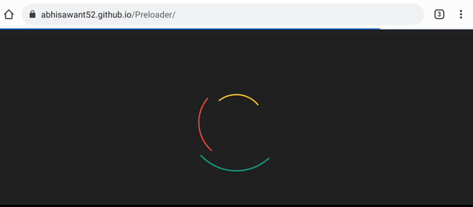

# Simple Page Preloader

Simple page Preloader with simple usage. Built using JavaScript/CSS only.




## Usage
To use it you need to add this code into your html page file:

```
<div id="loader">
<div class="outer-1">
<div class="inner-1"> &nbsp;
</div>
<div class="inner-2"> &nbsp;
</div>
</div></div>
```

Then link stylesheet and js file(from dist folder):

```
<link rel="stylesheet" type="text/css" href="style.css">
<script type="text/javascript" src="app.js"></script>
```

## Live Preview :

[View Page](https://abhisawant52.github.io/Preloader/).


